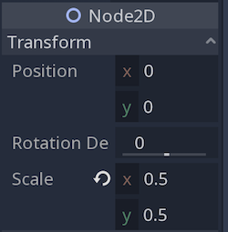
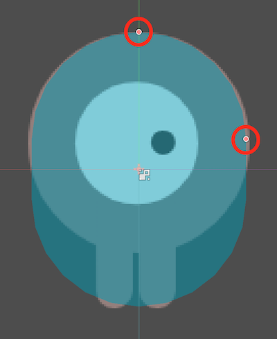

.. _doc_your_first_game:

Your first game
===============

Adapted from source: https://docs.godotengine.org/en/3.3/getting_started/step_by_step/your_first_game.html

Overview
--------

This tutorial will guide you through making your first Godot
project. You will learn how the Godot editor works, how to structure
a project, and how to build a 2D game.

The game is called "Dodge the Creeps!". Your character must move and
avoid the enemies for as long as possible. Here is a preview of the
final result:

.. image:: img/dodge_preview.gif

**Why 2D?** 3D games are much more complex than 2D ones. You should stick to 2D
until you have a good understanding of the game development process.

Project setup
-------------

Launch Godot and create a new project in an empty folder. Then, download
dodge_assets.zip from this folder - the images and sounds
you'll be using to make the game. Unzip these files to your project folder.

Your view will show a 3d space. Switch to 2d using the button at the top of
the screen.

This game will use portrait mode, so we need to adjust the size of the
game window. Click on Project -> Project Settings -> Display -> Window and
set "Width" to ``480`` and "Height" to ``720``.

Create a "2D Scene" root node using the button on the left hand side. You will
see the node in the scene window on the left. Rename it from "Node2D" to "Main".
This will be the main game area. You can now run the game by pressing the play
button in the top right corner. When asked to select a main scene, choose the
scene you just created. The game will then launch in a new window. Naturally, it
will be a blank grey window for now. We will add to it soon.

Nodes and Scenes
----------------
Nodes are fundamental building blocks for creating a game. As mentioned above,
a node can perform a variety of specialised functions. However, any given node
always has the following attributes:

-  It has a name.
-  It has editable properties.
-  It can receive a callback to process every frame.
-  It can be extended (to have more functions).
-  It can be added to another node as a child.

The last one is important. Nodes can have other nodes as
children. When arranged in this way, the nodes become a **tree**.

In Godot, the ability to arrange nodes in this way creates a powerful
tool for organising projects. Since different nodes have different
functions, combining them allows for the creation of more complex functions.

For example, a character in a game may consist of a number of nodes which
represent: their model, the contents of their backpack, the functionality of
their weapon and the set of sounds they make. In this way, a developer can
work on each building block separately and add them together to create the
'player' node, which is the root of the tree.

.. image:: img/scene_tree_example.png

Once a set of nodes are assembled into a tree representing a piece of the game,
they become a 'scene'. Examples of scenes in games could include a player,
enemies, the world, or the menu system.

Running a game means running a scene. A project can contain several scenes,
but for the game to start, one of them must be selected as the main scene
(for example, the 'world' scene).

Organising the project
~~~~~~~~~~~~~~~~~~~~~~

In this project, we will make 3 independent scenes: ``Player``,
``Mob``, and ``HUD``, which we will combine into the game's ``Main``
scene. In a larger project, it might be useful to make folders to hold
the various scenes and their scripts, but for this relatively small
game, you can save your scenes and scripts in the project's root folder,
referred to as ``res://``.  You can see your project folders in the FileSystem
Dock in the lower left corner:

Player scene
------------

The first scene we will make defines the ``Player`` object. One of the benefits
of creating a separate Player scene is that we can test it separately, even
before we've created other parts of the game.

Node structure
~~~~~~~~~~~~~~

To begin, select "New Scene" from the "Scene" menu. Again, we need to create a
root node, but this time choose "Other Node" and search for Area2D.

With ``Area2D`` we can detect objects that overlap or run into the player.
Change its name to ``Player`` by clicking on the node's name.
This is the scene's root node. We can add additional nodes to the player to add
functionality.

Before we add any children to the ``Player`` node, we want to make sure we don't
accidentally move or resize them by clicking on them. Select the node and
click the icon to the right of the lock; its tooltip says "Makes sure the object's children
are not selectable."

Save the scene as Player.tscn. Click Scene -> Save, or press ``Ctrl+S`` on Windows/Linux or ``Command+S`` on Mac.

Sprite animation
~~~~~~~~~~~~~~~~
We now have a 'player scene', but it has no functionality. Therefore, we want
to add a 2d animation to the player, called a 'sprite'.

Click on the ``Player`` node and add an AnimatedSprite node as a
child. The ``AnimatedSprite`` will handle the appearance and animations
for our player. Notice that there is a warning symbol next to the node.
An ``AnimatedSprite`` requires a SpriteFrames resource, which is a
list of the animations it can display. To create one, find the
``Frames`` property in the Inspector and click "<null>" ->
"New SpriteFrames". Next, in the same location, click
``<SpriteFrames>``, then click "Open Editor" to open the "SpriteFrames" panel:

On the left is a list of animations. Click the "default" one and rename
it to "right". Then click the "Add" button to create a second animation
named "up". Drag the two images for each animation, named ``playerGrey_up[1/2]``
and ``playerGrey_walk[1/2]``, into the "Animation Frames" side of the panel:

The player images are a bit too large for the game window, so we need to
scale them down. Click on the ``AnimatedSprite`` node and set the ``Scale``
property to ``(0.5, 0.5)``. You can find it in the Inspector under the
``Node2D`` heading.

Now the player is visible, however we still need to define its boundaries to
the game engine, this allows for the player to interact with the environment.

Add a CollisionShape2D as a child of ``Player``. This will determine the
player's "hitbox", or the bounds of its collision area. For this character,
a ``CapsuleShape2D`` node gives the best fit, so next to "Shape" in the
Inspector, click "<null>"" -> "New CapsuleShape2D".  Using the two size
handles inside the rectangle (not the ones outside), resize the shape to cover
the sprite:

When you're finished, your ``Player`` scene should look like this:

Finally, we can add the ``Player`` scene to the ``Main`` game scene. Select the ``Main``
scene from the tabs at the top of the screen to go back to the main scene and
click on the ``Main`` node in the left panel. To add the ``Player`` scene as a node
under the ``Main`` node, select the icon that looks like a chain and is called
"Instance Child Scene". Select the ``Player`` scene and it will now appear as a
child of the ``Main`` node.

.. image:: img/instance_scene.png

The player sprite should now appear in the top corner of the game window. Don't
worry about the positioning yet. Try running the game again using the play button
to confirm the sprite now appears in the corner. In the next section, we will add
movement to the character.

Remember to save your project.
