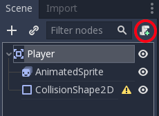
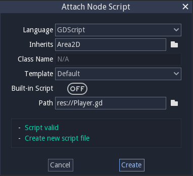
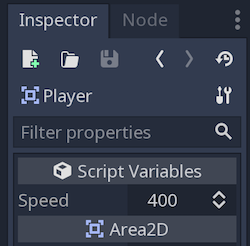

Moving the player
~~~~~~~~~~~~~~~~~

Now we need to add some functionality that we can't get from a built-in
node, so we'll add a script. Click the ``Player`` node and click the
"Add Script" button:

In the script settings window, you can leave the default settings alone. Just
click "Create":

We can now view the script, which has been filled out with a template already.
Lines beginning with a hash symbol (``#``) are 'comments' and are ignored by
Godot.

The first line ``extends Area2D`` brings in all the settings of an Area2D
object, we can ignore this for now.

The ``_ready()`` function is called when a node enters the scene tree (i.e.
when the Player is first added to the game). We don't need to do anything here
yet so we tell Godot to ``pass`` (i.e. move on).

We can use the ``_process()`` function to define what the player will do.
``_process()`` is called every frame. In other words, the game continually asks
our 'player' scene what it wants to do, and the player scene determines this
by running through the ``_process()`` command. The command is currently
commented out, therefore the player object does nothing as the game runs.
We need it to do the following:

- Check for input.
- Move in the given direction.
- Play the appropriate animation.

First, we need to check for input - is the player pressing a key? For
this game, we have 4 direction inputs to check - the arrow keys.

We can detect whether a key is pressed using
``Input.is_action_pressed()``, which returns ``true`` if it is pressed
or ``false`` if it isn't. We add the key into the command::

.. code-block:: GDScript
  func _process(delta):
    if Input.is_action_pressed("ui_right"):
        print("right key pressed")
    if Input.is_action_pressed("ui_left"):
        print("left key pressed")
    if Input.is_action_pressed("ui_down"):
        print("down key pressed")
    if Input.is_action_pressed("ui_up"):
        print("up key pressed")

Now we are detecting the correct keys, we want them to change the direction the
player is moving in. We can store the player's direction as a vector (i.e. a
line) which has an x and y value, and have each key adjust the direction.
Note that in this environment, the Y scale decreases in value as it moves up
on the screen.

.. code-block:: GDScript
  func _process(delta):
      var velocity = Vector2()        # The player's movement vector.
      if Input.is_action_pressed("ui_right"):
          velocity.x += 1
      if Input.is_action_pressed("ui_left"):
          velocity.x -= 1
      if Input.is_action_pressed("ui_down"):
          velocity.y += 1
      if Input.is_action_pressed("ui_up"):
          velocity.y -= 1

We start by setting the ``velocity`` to ``(0, 0)`` - by default the player
should not be moving. Then we check each input and add/subtract from the
``velocity`` to obtain a total direction. For example, if you hold ``right``
and ``down`` at the same time, the resulting ``velocity`` vector will be
``(1, 1)``. In this case, since we're adding a horizontal and a vertical
movement, the player would move *faster* than if it just moved horizontally.
We can prevent that if we *normalise* the velocity, which means we set
its *length* to ``1``.

.. code-block:: GDScript
  func _process(delta):
      var velocity = Vector2()        # The player's movement vector.
      if Input.is_action_pressed("ui_right"):
          velocity.x += 1
      if Input.is_action_pressed("ui_left"):
          velocity.x -= 1
      if Input.is_action_pressed("ui_down"):
          velocity.y += 1
      if Input.is_action_pressed("ui_up"):
          velocity.y -= 1
      velocity = velocity.normalized()  # Note: American spelling

Now we can set the character to be travelling at a speed of 1 in one of 8
directions, but we'd like to set a speed. We can store this as a variable at
the beginning of the script.

.. code-block:: GDScript
  extends Area2D

  export var speed = 400  # How fast the player will move (pixels/sec).

We use the ``export`` flag which allows us to set an override to the variable
from the Inspector (i.e. without changing the code). Click on the ``Player``
node and you'll see the property now appears in the "Script Variables" section
of the Inspector. Remember, if you change the value here, it will override the
value written in the script.

Now we can multiply the velocity by this speed value.

.. code-block:: GDScript
  func _process(delta):
      var velocity = Vector2()        # The player's movement vector.
      if Input.is_action_pressed("ui_right"):
          velocity.x += 1
      if Input.is_action_pressed("ui_left"):
          velocity.x -= 1
      if Input.is_action_pressed("ui_down"):
          velocity.y += 1
      if Input.is_action_pressed("ui_up"):
          velocity.y -= 1
      velocity = velocity.normalized() * speed

Finally, we can add a check for whether the player is moving so we can start
or stop the AnimatedSprite animation. Remember the velocity is set to 0 at the
beginning of each frame (each time ``_process()`` runs) so velocity will be 0
unless a key is being pressed.

.. code-block:: GDScript
  func _process(delta):
      var velocity = Vector2()        # The player's movement vector.
      if Input.is_action_pressed("ui_right"):
          velocity.x += 1
      if Input.is_action_pressed("ui_left"):
          velocity.x -= 1
      if Input.is_action_pressed("ui_down"):
          velocity.y += 1
      if Input.is_action_pressed("ui_up"):
          velocity.y -= 1
      if velocity.length() > 0:
          velocity = velocity.normalized() * speed
          $AnimatedSprite.play()
      else:
          $AnimatedSprite.stop()

Note:
In GDScript, ``$`` returns the node at the relative path from the current node,
or returns ``null`` if the node is not found. Since AnimatedSprite is a child
of the current node, we can use ``$AnimatedSprite``. ``$`` is shorthand for
``get_node()`` So in the code above, ``$AnimatedSprite.play()`` is the same as
``get_node("AnimatedSprite").play()``.

Now we are setting a movement direction and speed for the player object based
on the keys being pressed, but the player object doesn't know what to do with
those values. Therefore, we need to explain to player object how to update its
position based on the direction we give it.

Remember we set the speed of player to 400 pixels per second. Therefore, if we
pass the player the instructions to move left at a speed of 400 pixels/sec, we
need to divide the value of 400 by the fraction of a second that the frame
represents. This value is given to us as ``delta``, so we can multiply our speed
of 400 by the value ``delta`` to decide how far the player needs to move for
this frame.

Our player object has an attribute ``position``, so to represent movement, we
simply need to tell it to exist at a new position for this frame, much like how
an animation works. We calculate this new position by taking the current
position and adding the velocity (which could be a negative value):

.. code-block:: GDScript
  position += velocity * delta

Finally, we would like to prevent the player leaving the screen, as we'd have
no idea where it was. We can do this easily by constraining the position value
to be within the window size. First we can store the window size in a variable
we define at the beginning of the script, and we get the window size and store
it to this variable when we initialise the object -- in the ``_ready()``
function.

.. code-block:: GDScript
  extends Area2D

  export var speed = 400  # How fast the player will move (pixels/sec).
  var screen_size  # Size of the game window.

.. code-block:: GDScript
  func _ready():
      screen_size = get_viewport_rect().size

Then we can update our ``_process()`` function to force the ``position`` to be
within these boundaries using ``clamp()``:

.. code-block:: GDScript
  position += velocity * delta
  position.x = clamp(position.x, 0, screen_size.x)
  position.y = clamp(position.y, 0, screen_size.y)

In the above code, clamp returns a value based on the following logic:
``clamp(value_to_consider, minimum_value_acceptable, maximum_value_acceptable)``
Therefore if the ``position.x`` is between 0 and 480, ``clamp()`` will return
``position.x``, if it is smaller than 0, ``clamp()`` will return 0, and if it
is higher, ``clamp()`` will return 480. Thus we cannot set the position of our
character outside the window.

Click "Play Scene" (``F6``) and confirm you can move the player
around the screen in all directions.
