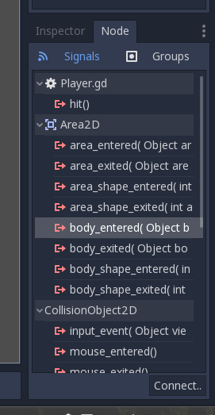

Choosing animations
~~~~~~~~~~~~~~~~~~~

Now that the player can move, we need to change which animation the
AnimatedSprite is playing based on direction. We have a "right"
animation, which should be flipped horizontally using the ``flip_h``
property for left movement, and an "up" animation, which should be
flipped vertically with ``flip_v`` for downward movement.
Let's place this code at the end of our ``_process()`` function:

.. code-block:: GDScript
  if velocity.x < 0:
    $AnimatedSprite.flip_h = true
  else:
    $AnimatedSprite.flip_h = false

When we use an expression such as ``velocity.x < 0``, the returned value will
either be ``true`` or ```false``. Therefore, we can streamline the above code
into a single line as: ``$AnimatedSprite.flip_h = velocity.x < 0``
Finally, we want to choose the correct animation from the set we created
earlier -- "right" if we're moving left or right, and "up" if we're moving up
or down (in this implementation, diagonal movement will use the "right"
animation).

.. code-block:: GDScript
  if velocity.x != 0:
      $AnimatedSprite.animation = "right"
  elif velocity.y != 0:
      $AnimatedSprite.animation = "up"
	$AnimatedSprite.flip_h = velocity.x < 0
	$AnimatedSprite.flip_v = velocity.y > 0


Play the scene again and check that the animations are correct in each
of the directions. When you're sure the movement is working correctly,
add this line to ``_ready()``, so the player will be hidden when the game
starts:

.. code-block:: GDScript
  hide()


Preparing for collisions
~~~~~~~~~~~~~~~~~~~~~~~~

We want ``Player`` to detect when it's hit by an enemy, but we haven't
made any enemies yet! That's OK, because we're going to use Godot's
*signal* functionality to make it work.

Add the following at the top of the script, after ``extends Area2d``:

.. code-block:: GDScript
  signal hit

This defines a custom signal called "hit" that we will have our player
emit (send out) when it collides with an enemy. This is how our player will
tell the  game that is has been hit, and what should happen. We will define
this later.

We will use ``Area2D`` features to detect the collision. Select the ``Player``
node and click the "Node" tab next to the Inspector tab to see the list of
signals the player can emit:



Notice our custom "hit" signal is there as well! Since our enemies are
going to be ``RigidBody2D`` nodes, we want the
``body_entered( Object body )`` signal; this will be emitted when another
body (e.g. of an enemy) enters (contacts) the body of the player. Click
"Connect.." and then "Connect" again on the "Connecting Signal" window. We
don't need to change any of these settings - Godot will automatically create a
function in your player's script. This function will be called whenever the
signal is emitted (i.e. whenever the player is hit).

Add this code to the function:

.. code-block:: GDScript
  func _on_Player_body_entered(body):
      hide()  # Player disappears after being hit.
      emit_signal("hit")  # Player tells the game it has been hit.

Each time an enemy hits the player, the ``hit`` signal will be emitted. We need
to disable the player's collision after the first collision so that we don't
trigger the ``hit`` signal more than once. We can do that by disabling the
``CollisionShape2D`` node of the player. Typically, this would be done with the
command ``$CollisionShape2D.disabled = true``, however, disabling the area's
collision shape can cause an error if it happens in the middle of the engine's
collision processing. Using ``call_deferred()`` allows us to have Godot wait to
disable the shape until it's safe to do so.

.. code-block:: GDScript
  func _on_Player_body_entered(body):
      hide()  # Player disappears after being hit.
      emit_signal("hit")  # Player tells the game it has been hit.
      $CollisionShape2D.call_deferred("set_disabled", true)

Finally, we need to add a function we can call to reset the player when
starting a new game. We show the player, move them to the middle of the screen
and turn their CollisionShape2D on.

.. code-block:: GDScript
  func start():
      position.x = screen_size.x / 2
      position.y = screen_size.y / 2
      show()
      $CollisionShape2D.disabled = false

We now have a completed player scene which we can add to the main game. Our
player will spawn when we run it's ``start()`` function, can move around the
screen, and will disappear and emit a ``hit`` signal when it collides with
another body.
