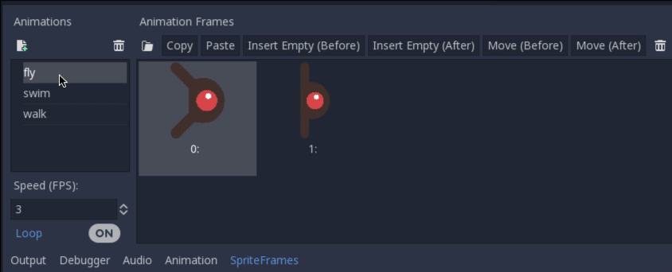

Enemy scene
-----------

Now it's time to make the enemies our player will have to dodge. Their
behaviour will not be very complex: mobs will spawn randomly at the edges
of the screen and move in a random direction in a straight line, then
despawn when they go offscreen.

We will build this into a ``Mob`` scene, which we can then *instance* to
create any number of independent mobs in the game. Instancing is when we use
multiple copies of the same scene in the game, each of which may have their own
unique characteristics.

Node setup
~~~~~~~~~~

Click Scene -> New Scene and we'll create the Mob.

The Mob scene will use the following nodes which you can add:

- RigidBody2D (named ``Mob``)
   -  AnimatedSprite
   -  CollisionShape2D
   -  VisibilityNotifier2D (named ``Visibility``)

This is very similar to our player object. The main difference is the addition
of the VisibilityNotifier2D node, which is able to check whether the scene (mob)
is visible, and send signals based on the result. We can use this to create a
signal when a mob moves off the screen (to delete them).

Don't forget to set the children so they can't be selected, like you did with
the Player scene.

In the RigidBody2D properties, set ``Gravity Scale`` to ``0``, so
the mob will not fall downward. In addition, under the
``PhysicsBody2D`` section, click the ``Mask`` property and
uncheck the first box. This will ensure the mobs do not collide with each other.

Set up the AnimatedSprite like you did for the player.
This time, we have 3 animations: ``fly``, ``swim``, and ``walk``. Set the ``Playing``
property in the Inspector to "On" and adjust the "Speed (FPS)" setting as shown below.
We'll select one of these animations randomly so that the mobs will have some variety.

``fly`` should be set to 3 FPS, with ``swim`` and ``walk`` set to 4 FPS.

Like the player images, these mob images need to be scaled down. Set the
``AnimatedSprite``'s ``Scale`` property to ``(0.75, 0.75)``. Check the 'playing'
box so the animation is playing by default.

As in the ``Player`` scene, add a ``CapsuleShape2D`` for the
collision. To align the shape with the image, you'll need to set the
``Rotation Degrees`` property to ``90`` under ``Node2D``.

Enemy script
~~~~~~~~~~~~

Add a script to the ``Mob`` and add the following member variables. We want our
mobs to be different, so unlike the player object, we set a max and min speed
and we will choose a value between these each time a new mob is created. We
also make a list of mob types (as per the animations we added) so we can
choose between them later. Make sure they are spelled the same as in the
AnimatedSprite node.

.. code-block:: GDScript

  extends RigidBody2D

  export var min_speed = 150  # Minimum speed range.
  export var max_speed = 250  # Maximum speed range.
  var mob_types = ["walk", "swim", "fly"]

Now let's look at the rest of the script. In ``_ready()`` we randomly
choose one of the three animation types:

.. code-block:: GDScript

  func _ready():
    $AnimatedSprite.animation = mob_types[randi() % mob_types.size()]

Note: You must use ``randomize()`` if you want your sequence of "random"
numbers to be different every time you run the scene. We're going to use
``randomize()`` in our ``Main`` scene so we won't need it here. ``randi() % n``
is the standard way to get a random integer between ``0`` and ``n-1``.

The last piece is to make the mobs delete themselves when they leave the
screen. Connect the ``screen_exited()`` signal of the ``Visibility``
node to the Mob script, and add this code:

.. code-block:: GDScript

  func _on_Visibility_screen_exited():
    queue_free()

This completes the `Mob` scene.
