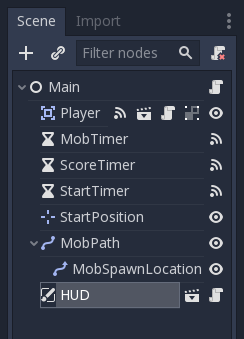

HUD
---

The final piece our game needs is a UI: an interface to display things
like score, a "game over" message, and a restart button. Create a new
scene, and add a CanvasLayer node named ``HUD``. "HUD" stands for
"heads-up display", an informational display that appears as an
overlay on top of the game view.

The CanvasLayer node lets us draw our UI elements on a layer above the rest of
the game, so that the information it displays isn't covered up by any game
elements like the player or mobs.

The HUD displays the following information:

-  Score, changed by ``ScoreTimer``.
-  A message, such as "Game Over" or "Get Ready!"
-  A "Start" button to begin the game.

The basic node for UI elements is Control. To create our UI, we'll use two
types of Control nodes: Label and Button.

Create the following as children of the ``HUD`` node:

-  Label named ``ScoreLabel``.
-  Label named ``MessageLabel``.
-  Button named ``StartButton``.
-  Timer named ``MessageTimer``.

Click on the ``ScoreLabel`` and type a number into the _Text_ field in the
Inspector. The default font for ``Control`` nodes is small and doesn't scale
well. There is a font file included in the game assets called
"Xolonium-Regular.ttf". To use this font, do the following for each of
the three ``Control`` nodes:

1. Under "Custom Fonts", choose "New DynamicFont"

2. Click on the "DynamicFont" you added, and under "Font/Font Data",
   choose "Load" and select the "Xolonium-Regular.ttf" file. You must
   also set the font's ``Size``. A setting of ``64`` works well.

Arrange the nodes as shown below. Click the "Anchor" button to
set a Control node's anchor:

You can drag the nodes to place them manually, or for more precise
placement, use the following settings:

ScoreLabel
~~~~~~~~~~

-  *Text* : ``0``
-  *Layout* : "Top Wide"
-  *Align* : "Center"

MessageLabel
~~~~~~~~~~~~

-  *Text* : ``Dodge the Creeps!``
-  *Layout* : "HCenter Wide"
-  *Align* : "Center"

StartButton
~~~~~~~~~~~

-  *Text* : ``Start``
-  *Layout* : "Center Bottom"
-  *Margin* :

   -  Top: ``-200``
   -  Bottom: ``-100``

Now add this script to ``HUD``:

.. code-block:: GDScript

  extends CanvasLayer

  signal start_game

The ``start_game`` signal tells the ``Main`` node that the button
has been pressed.

.. code-block:: GDScript

  func show_message(text):
    $MessageLabel.text = text
    $MessageLabel.show()
    $MessageTimer.start()

This function is called when we want to display a message
temporarily, such as "Get Ready". On the ``MessageTimer``, set the
``Wait Time`` to ``2`` and set the ``One Shot`` property to "On".

.. code-block:: GDScript

  func show_game_over():
    show_message("Game Over")
    yield($MessageTimer, "timeout")
    $MessageLabel.text = "Dodge the\nCreeps!"
    $MessageLabel.show()
    $StartButton.show()

This function is called when the player loses. It will show "Game
Over" for 2 seconds, then return to the title screen and show the "Start"
button.

.. code-block:: GDScript

  func update_score(score):
    $ScoreLabel.text = str(score)

This function is called by ``Main`` whenever the score changes.

Connect the ``timeout()`` signal of ``MessageTimer`` and the
``pressed()`` signal of ``StartButton``.

.. code-block:: GDScript

  func _on_MessageTimer_timeout():
    $MessageLabel.hide()

  func _on_StartButton_pressed():
    $StartButton.hide()
    emit_signal("start_game")

Connecting HUD to Main
~~~~~~~~~~~~~~~~~~~~~~

Now that we're done creating the ``HUD`` scene, save it and go back to ``Main``.
Instance the ``HUD`` scene in ``Main`` like you did the ``Player`` scene, and
place it at the bottom of the tree. The full tree should look like this,
so make sure you didn't miss anything:

Now we need to connect the ``HUD`` functionality to our ``Main`` script.
This requires a few additions to the ``Main`` scene:

In the Node tab, connect the HUD's ``start_game`` signal to the
``new_game()`` function. Remove ``new_game()`` from the ``_ready()`` function
in ``Main.gd`` as we will start a new game with the button now.

In ``new_game()``, update the score display and show the "Get Ready"
message:

.. code-block:: GDScript

  $HUD.update_score(score)
  $HUD.show_message("Get Ready")

In ``game_over()`` we need to call the corresponding ``HUD`` function:

.. code-block:: GDScript

  $HUD.show_game_over()

Finally, add this to ``_on_ScoreTimer_timeout()`` to keep the display in
sync with the changing score:

.. code-block:: GDScript

  $HUD.update_score(score)

Now you're ready to play! Click the "Play the Project" button. You will
be asked to select a main scene, so choose ``Main.tscn``.

Finishing up
------------

We have now completed all the functionality for our game. Feel free to expand
the gameplay with your own ideas.
