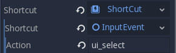

Further Enhancements
------------

Background
~~~~~~~~~~

The default gray background is not very appealing, so let's change its
color. One way to do this is to use a :ref:`ColorRect <class_ColorRect>` node.
Make it the first node under ``Main`` so that it will be drawn behind the other
nodes. ``ColorRect`` only has one property: ``Color``. Choose a color
you like and drag the size of the ``ColorRect`` so that it covers the
screen.

You could also add a background image, if you have one, by using a
``Sprite`` node.

Sound effects
~~~~~~~~~~~~~

Sound and music can be the single most effective way to add appeal to
the game experience. In your game assets folder, you have two sound
files: "House In a Forest Loop.ogg" for background music, and
"gameover.wav" for when the player loses.

Add two :ref:`AudioStreamPlayer <class_AudioStreamPlayer>` nodes as children of ``Main``. Name one of
them ``Music`` and the other ``DeathSound``. On each one, click on the
``Stream`` property, select "Load", and choose the corresponding audio
file.

To play the music, add ``$Music.play()`` in the ``new_game()`` function
and ``$Music.stop()`` in the ``game_over()`` function.

Finally, add ``$DeathSound.play()`` in the ``game_over()`` function.

Keyboard Shortcut
~~~~~~~~~~~~~~~~~

Since the game is played with keyboard controls, it would be convenient if we
could also start the game by pressing a key on the keyboard. One way to do this
is using the "Shortcut" property of the ``Button`` node.

In the ``HUD`` scene, select the ``StartButton`` and find its _Shortcut_ property
in the Inspector. Select "New Shortcut" and click on the "Shortcut" item. A
second _Shortcut_ property will appear. Select "New InputEventAction" and click
the new "InputEvent". Finally, in the _Action_ property, type the name "ui_select".
This is the default input event associated with the spacebar.

Now when the start button appears, you can either click it or press the spacebar
to start the game.

ToDo:
~~~~~~~~~~~~~~~~~
Despawn mobs on death
Stop score proceeding after fast game over -- see original build
Power ups
