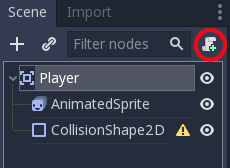
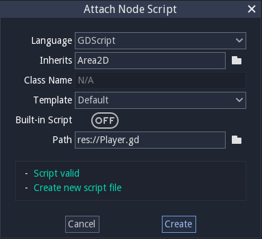
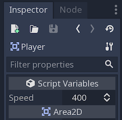

Moving the player
~~~~~~~~~~~~~~~~~

Now we need to add some functionality that we can't get from a built-in
node, so we'll add a script. Click the ``Player`` node and click the
"Add Script" button:

In the script settings window, you can leave the default settings alone. Just
click "Create":

Start by declaring the member variables this object will need:

.. code-block:: GDScript

  extends Area2D

  export var speed = 400  # How fast the player will move (pixels/sec).
  var screen_size  # Size of the game window.

.. code:: javascript

    function whatever() {
        return "such color"
    }

Using the ``export`` keyword on the first variable ``speed`` allows us to
set its value in the Inspector. This can be handy for values that you
want to be able to adjust just like a node's built-in properties. Click on
the ``Player`` node and you'll see the property now appears in the "Script
Variables" section of the Inspector. Remember, if you change the value here, it
will override the value written in the script.

The ``_ready()`` function is called when a node enters the scene tree,
which is a good time to find the size of the game window:

.. code-block:: gdscript GDScript
  func _ready():
      screen_size = get_viewport_rect().size

Now we can use the ``_process()`` function to define what the player will do.
``_process()`` is called every frame, so we'll use it to update
elements of our game, which we expect will change often. For the player, we
need to do the following:

- Check for input.
- Move in the given direction.
- Play the appropriate animation.

First, we need to check for input - is the player pressing a key? For
this game, we have 4 direction inputs to check. Input actions are defined
in the Project Settings under "Input Map". Here, you can define custom events and
assign different keys, mouse events, or other inputs to them. For this demo,
we will use the default events that are assigned to the arrow keys on the
keyboard.

You can detect whether a key is pressed using
``Input.is_action_pressed()``, which returns ``true`` if it is pressed
or ``false`` if it isn't.

.. tabs::
 .. code-tab:: gdscript GDScript

    func _process(delta):
        var velocity = Vector2()  # The player's movement vector.
        if Input.is_action_pressed("ui_right"):
            velocity.x += 1
        if Input.is_action_pressed("ui_left"):
            velocity.x -= 1
        if Input.is_action_pressed("ui_down"):
            velocity.y += 1
        if Input.is_action_pressed("ui_up"):
            velocity.y -= 1
        if velocity.length() > 0:
            velocity = velocity.normalized() * speed
            $AnimatedSprite.play()
        else:
            $AnimatedSprite.stop()

 .. code-tab:: csharp

    public override void _Process(float delta)
    {
        var velocity = new Vector2(); // The player's movement vector.

        if (Input.IsActionPressed("ui_right"))
        {
            velocity.x += 1;
        }

        if (Input.IsActionPressed("ui_left"))
        {
            velocity.x -= 1;
        }

        if (Input.IsActionPressed("ui_down"))
        {
            velocity.y += 1;
        }

        if (Input.IsActionPressed("ui_up"))
        {
            velocity.y -= 1;
        }

        var animatedSprite = GetNode<AnimatedSprite>("AnimatedSprite");

        if (velocity.Length() > 0)
        {
            velocity = velocity.Normalized() * Speed;
            animatedSprite.Play();
        }
        else
        {
            animatedSprite.Stop();
        }
    }

We start by setting the ``velocity`` to ``(0, 0)`` - by default the player
should not be moving. Then we check each input and add/subtract from the
``velocity`` to obtain a total direction. For example, if you hold ``right``
and ``down`` at the same time, the resulting ``velocity`` vector will be
``(1, 1)``. In this case, since we're adding a horizontal and a vertical
movement, the player would move *faster* than if it just moved horizontally.

We can prevent that if we *normalize* the velocity, which means we set
its *length* to ``1``, and multiply by the desired speed. This means no
more fast diagonal movement.

.. tip:: If you've never used vector math before, or need a refresher,
         you can see an explanation of vector usage in Godot at :ref:`doc_vector_math`.
         It's good to know but won't be necessary for the rest of this tutorial.

We also check whether the player is moving so we can start or stop the
AnimatedSprite animation.

.. tip:: In GDScript, ``$`` returns the node at the relative path from the current node, or returns ``null`` if the node is not found.
         Since AnimatedSprite is a child of the current node, we can use ``$AnimatedSprite``.

         ``$`` is shorthand for ``get_node()``.
         So in the code above, ``$AnimatedSprite.play()`` is the same as ``get_node("AnimatedSprite").play()``.

Now that we have a movement direction, we can update the player's position
and use ``clamp()`` to prevent it from leaving the screen by adding the following
to the bottom of the ``_process`` function:

.. tabs::
 .. code-tab:: gdscript GDScript

        position += velocity * delta
        position.x = clamp(position.x, 0, screen_size.x)
        position.y = clamp(position.y, 0, screen_size.y)

 .. code-tab:: csharp

        Position += velocity * delta;
        Position = new Vector2(
            x: Mathf.Clamp(Position.x, 0, _screenSize.x),
            y: Mathf.Clamp(Position.y, 0, _screenSize.y)
        );

.. tip:: *Clamping* a value means restricting it to a given range.

Click "Play Scene" (``F6``) and confirm you can move the player
around the screen in all directions. The console output that opens upon playing
the scene can be closed by clicking ``Output`` (which should be highlighted in
blue) in the lower left of the Bottom Panel.

.. warning:: If you get an error in the "Debugger" panel that refers to a "null instance",
             this likely means you spelled the node name wrong. Node names are case-sensitive
             and ``$NodeName`` or ``get_node("NodeName")`` must match the name you see in the scene tree.

Choosing animations
~~~~~~~~~~~~~~~~~~~

Now that the player can move, we need to change which animation the
AnimatedSprite is playing based on direction. We have a "right"
animation, which should be flipped horizontally using the ``flip_h``
property for left movement, and an "up" animation, which should be
flipped vertically with ``flip_v`` for downward movement.
Let's place this code at the end of our ``_process()`` function:

.. tabs::
 .. code-tab:: gdscript GDScript

        if velocity.x != 0:
            $AnimatedSprite.animation = "right"
            $AnimatedSprite.flip_v = false
            # See the note below about boolean assignment
            $AnimatedSprite.flip_h = velocity.x < 0
        elif velocity.y != 0:
            $AnimatedSprite.animation = "up"
            $AnimatedSprite.flip_v = velocity.y > 0

 .. code-tab:: csharp

        if (velocity.x != 0)
        {
            animatedSprite.Animation = "right";
            // See the note below about boolean assignment
            animatedSprite.FlipH = velocity.x < 0;
            animatedSprite.FlipV = false;
        }
        else if(velocity.y != 0)
        {
            animatedSprite.Animation = "up";
            animatedSprite.FlipV = velocity.y > 0;
        }

.. Note:: The boolean assignments in the code above are a common shorthand
          for programmers. Consider this code versus the shortened
          boolean assignment above:

          .. tabs::
           .. code-tab :: gdscript GDScript

             if velocity.x < 0:
                 $AnimatedSprite.flip_h = true
             else:
                 $AnimatedSprite.flip_h = false

           .. code-tab:: csharp

             if velocity.x < 0:
                 animatedSprite.FlipH = true
             else:
                 animatedSprite.FlipH = false

Play the scene again and check that the animations are correct in each
of the directions. When you're sure the movement is working correctly,
add this line to ``_ready()``, so the player will be hidden when the game
starts:

.. tabs::
 .. code-tab:: gdscript GDScript

    hide()

 .. code-tab:: csharp

    Hide();

Preparing for collisions
~~~~~~~~~~~~~~~~~~~~~~~~

We want ``Player`` to detect when it's hit by an enemy, but we haven't
made any enemies yet! That's OK, because we're going to use Godot's
*signal* functionality to make it work.

Add the following at the top of the script, after ``extends Area2d``:

.. tabs::
 .. code-tab:: gdscript GDScript

    signal hit

 .. code-tab:: csharp

    // Don't forget to rebuild the project so the editor knows about the new signal.

    [Signal]
    public delegate void Hit();

This defines a custom signal called "hit" that we will have our player
emit (send out) when it collides with an enemy. We will use ``Area2D`` to
detect the collision. Select the ``Player`` node and click the "Node" tab
next to the Inspector tab to see the list of signals the player can emit:

.. image:: img/player_signals.png

Notice our custom "hit" signal is there as well! Since our enemies are
going to be ``RigidBody2D`` nodes, we want the
``body_entered( Object body )`` signal; this will be emitted when a
body contacts the player. Click "Connect.." and then "Connect" again on
the "Connecting Signal" window. We don't need to change any of these
settings - Godot will automatically create a function in your player's script.
This function will be called whenever the signal is emitted - it *handles* the
signal.

.. tip:: When connecting a signal, instead of having Godot create a
         function for you, you can also give the name of an existing
         function that you want to link the signal to.

Add this code to the function:

.. tabs::
 .. code-tab:: gdscript GDScript

    func _on_Player_body_entered(body):
        hide()  # Player disappears after being hit.
        emit_signal("hit")
        $CollisionShape2D.call_deferred("set_disabled", true)

 .. code-tab:: csharp

    public void OnPlayerBodyEntered(PhysicsBody2D body)
    {
        Hide(); // Player disappears after being hit.
        EmitSignal("Hit");
        GetNode<CollisionShape2D>("CollisionShape2D").Disabled = true;
    }

Each time an enemy hits the player, the signal is going to be emitted. We need
to disable the player's collision so that we don't trigger the ``hit`` signal
more than once.

.. Note:: Disabling the area's collision shape can cause an error if it happens
          in the middle of the engine's collision processing. Using ``call_deferred()``
          allows us to have Godot wait to disable the shape until it's safe to
          do so.

The last piece for our player is to add a function we can call to reset
the player when starting a new game.

.. tabs::
 .. code-tab:: gdscript GDScript

    func start(pos):
        position = pos
        show()
        $CollisionShape2D.disabled = false

 .. code-tab:: csharp

    public void Start(Vector2 pos)
    {
        Position = pos;
        Show();
        GetNode<CollisionShape2D>("CollisionShape2D").Disabled = false;
    }
